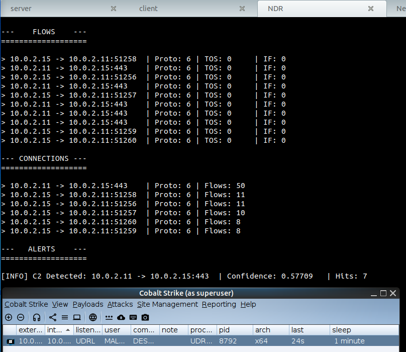
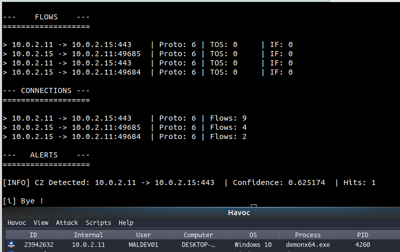

# The Poor Man's AI-based NDR 

This repo contains the code to create your very own 2k25 super-turbo-slick AI-based network detection and response (NDR). 

As to reflect any AI projet, the repo contains two parts: `Training` directory contains the `model_training.ipynb` notebook that you can use to train a Recurrent Neural Network (RNN) with Gated Recurrent Units (GRUs) to detect Command and Control (CnC) network traffic.

`NDR` directory contains the source code for a C++ client which embeds the neural network using `LibTorch`. This client parses packet from the system's raw sockets, encodes them, and feeds them to the RNN. If it flags potential CnC traffic, an alert is printed on the screen. 

This work would not have been possible without previous work from `S. Garcia et al.`, who invented the encoding mechanism known as `StratoLetters` that is used to create the behavioural model fed to the RNN. To see their works have a look at `StratosphereIPS`. For details on the encoding, check the original paper from Garcia in the `Training` directory.

## Training

You do not need to train the model. The trained model is already available in two formats. `Training/rnn_gru_detection_cnc.pth` is the `PyTorch` suitable format, to use with python (e.g. in the notebook) - and `NDR/rnn_trace.pt`, which is the `TorchScript` format for the same RNN, suitable for low-level implementations. 

## Compiling

The NDR is already compiled under `NDR/flowtracker`. If you wish to recompile it, run `cd NDR` and `make`. This program depends on `LibTorch` which is not included in this repo. You can download it for you machine on `https://pytorch.org/get-started/locally/` and unzip it under `NDR/LibTorch`

## Running

To use the program `flowtracker`, you have to specify the following command line arguments: 

```commandline
./flowtracker -m min_flows -t threshold -n nb_consecutive -c consecutive_flag -T tcp_flag -U udp_flag
```

where: 

\- `min_flows` is the minimum number of flows to collect in a connection before doing the behavioural analysis (default=`4`)

\- `threshold` is the decision threshold for the last activation cell of the RNN (default=`0.56`)

\- `nb_consecutive` is the number of flows that need to be above threshold for the connection to trigger an alert (default=`3`)

\- `consecutive_flag` indicates if those flows need to be consecutive or cumulative (default=`False` - cumulative mode)

\- `tcp_flag` indicates wether `TCP` packets should be processed.

\- `udp_flag` indicates wether `UDP` packets should be processed.  

## Testing

Once you run the software, you can test by using the `client.py` testing program, which emulates a strongly periodic signal, as a client connecting back to it's C2 server. Try it as: 

```commandline
# start a server on localhost
nc -nvlkp 9999

# run the client
python3 client.py
```

You should see your poor man's NDR trigger an alert like this: 

```commandline
[INFO] C2 Detected: 127.0.0.1 -> 127.0.0.1:9999	| Confidence: 0.603849	| Hits: 1
```

Where `Confidence` indicates the output of the sigmoid activation cell at the very end of the RNN, i.e., the probability that this connection is a CnC channel. `Hits` indicates the number of flows that triggered above the threshold in this connection.  

## Interface

The interface is a basic terminal UI (see below) where the first pannel describes the top 10 ongoing flows, the second pannel describes the top 10 ongoing connections, and the third pannel describes the top 10 most-likely CnC channels. To change the number of rows displayed, update `main.cpp` at `const size_t UI_MAX_ROWS = 10;` and recompile. 

```commandline
---    FLOWS    ---
===================

> 142.X.X.X -> 10.X.X.X:35080	| Proto: 6 | TOS: 0	| IF: 0
> 127.0.0.1 -> 127.0.0.1:55761	| Proto: 6 | TOS: 0	| IF: 0
> 127.0.0.1 -> 127.0.0.1:65248	| Proto: 6 | TOS: 0	| IF: 0
> 127.0.0.1 -> 127.0.0.1:49349	| Proto: 6 | TOS: 0	| IF: 0
> 127.0.0.1 -> 127.0.0.1:63872	| Proto: 6 | TOS: 0	| IF: 0
> 127.0.0.1 -> 127.0.0.1:57497	| Proto: 6 | TOS: 0	| IF: 0
> 127.0.0.1 -> 127.0.0.1:61480	| Proto: 6 | TOS: 0	| IF: 0
> 127.0.0.1 -> 127.0.0.1:60039	| Proto: 6 | TOS: 0	| IF: 0
> 127.0.0.1 -> 127.0.0.1:64251	| Proto: 6 | TOS: 0	| IF: 0
> 142.X.X.X -> 10.X.X.X:35080	| Proto: 6 | TOS: 128	| IF: 0

--- CONNECTIONS ---
===================

> 142.X.X.X -> 10.X.X.X:35080	| Proto: 6 | Flows: 6
> 142.X.X.X -> 10.X.X.X:35076	| Proto: 6 | Flows: 6
> 127.0.0.1 -> 127.0.0.1:49349	| Proto: 6 | Flows: 3
> 127.0.0.1 -> 127.0.0.1:61480	| Proto: 6 | Flows: 3
> 127.0.0.1 -> 127.0.0.1:57497	| Proto: 6 | Flows: 3
> 127.0.0.1 -> 127.0.0.1:65248	| Proto: 6 | Flows: 3
> 127.0.0.1 -> 127.0.0.1:55761	| Proto: 6 | Flows: 3
> 127.0.0.1 -> 127.0.0.1:64251	| Proto: 6 | Flows: 3
> 127.0.0.1 -> 127.0.0.1:63872	| Proto: 6 | Flows: 3
> 127.0.0.1 -> 127.0.0.1:60039	| Proto: 6 | Flows: 3

---   ALERTS    ---
===================

[INFO] C2 Detected: 127.0.0.1 -> 127.0.0.1:9999	| Confidence: 0.603849	| Hits: 1
```

## Future works

I'll work on the Windows version soon. Meanwhile, just snap this on raspberry pi connected to you router and observe what's going on. 

## Examples

Below are some screenshot of beacon detection for CobaltStrike or Havoc C2. 




